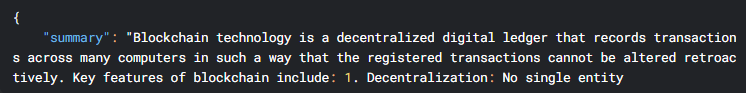
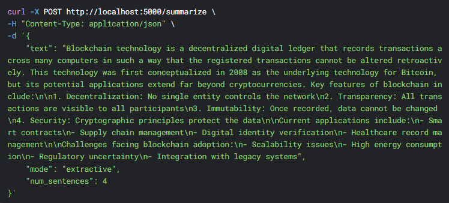

# Text Summarizer with Sentiment Analysis

A comprehensive text summarization system that combines extractive and abstractive techniques with sentiment analysis to provide "summary + tone" reports.

---

## Features

- **Extractive Summarization**: Uses TextRank algorithm to identify and extract key sentences
- **Abstractive Summarization**: Leverages pretrained BART/T5 models to generate human-like summaries
- **Hybrid Approach**: Combines extractive and abstractive methods for optimal results
- **Sentiment Analysis**: Determines the tone of the document (positive/negative with confidence)
- **File Processing**: Can process both direct text input and text files
- **Customizable**: Adjust summary length and choose between different summarization approaches
  
---

## 🖼️ UI Preview

  
  


## Installation

1. Clone the repository:
   ```bash
   git clone https://github.com/yourusername/text-summarizer.git
   cd text-summarizer
